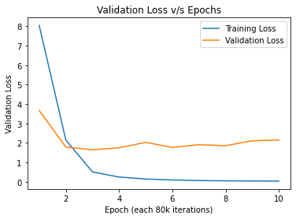
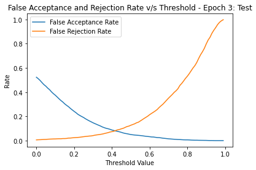

# PyTorch Implementation of "Generalized End-to-End Loss for Speaker Verification"
## Introduction
This repository contains my implementation of Generalized End-to-End Loss for Speaker Verification [[1]](#1) (ICASSP 2019) in PyTorch. The choice of segmentation is motivated from [[2]](#2), while the some of the hyperparameter choices are from [[1]](#1).

The dataset used is TIMIT [[3]](#3), which is available for free at Kaggle.
## Requirements
To install the python dependencies for this project, run
```
pip install -r requirements.txt
```
### Note
If `pip` defaults to `pip2` in your system, replace it with `pip3`.

## Directory Structure
The dataset and samples are in the `data/` directory. The training checkpoints are in the `checkpoints` directory, while `notebook/` has the original notebook used to train the model. Scripts related to loading, and (pre-)processing data can be found in `utils/data.py` whereas `utils/globals.py` has some global variables. The configuration of the model (for both training and usage) may be modified from `config.py`. In `models/models.py` you will find functions to define and train the model, while in `models/eval.py` there are functions related to the calculation of False Rejection Rate, False Acceptance Rate and Equal-Error-Rate (EER). The main driver functions that interface with the user input are in `main.py`. Finally, `assets/` houses the plots that appear in this README.
## Usage
The data is already preprocessed. However, to run preprocessing again, run
```
python main.py --preprocess
```
To train the Embedder and Loss Module again, run
```
python main.py --train
```
To run evaluation to produce the Equal-Error-Rate and threshold at which the EER is achieved, run
```
python main.py --eval
```
By default this uses the model from checkpoint 3 (as we found this to generalize the best) on the test set. To change the checkpoint number and/or the data split, use the `--checkpt` and `--split` flags. The former can also be used when calculating similarity scores (see below). Optionally, to save a plot of the False Acceptance and Rejection Rates v/s the threshold values, specify the path to the plot using the `--path` option. 

To calculate the similarity score between two audio files (decide whether they have the same speaker), run
```
python main.py --similarity --path1 <path-to-audio-1> --path2 <path-to-audio-2>
```
This will print the similarity score and the decision. The default threshold used is `0.75`, and can be changed using the `--thresh` argument. Some samples audio clips are in `data/samples`.
### Note
Above, if `python` defaults to `python2` on your device, use `python3` instead.
## Key Idea
The crux of the whole framework may be summarized using the following image.

 

### The Embedder
The intention is to train the embedder to extract a vector that contains information only about the speaker and not about the specific words spoken. The output is always unit normalized, so using cosine similarity between the representations from two audio snippets should give us a similarity score in `[-1,1]`. The embedder we use has the same hyperparameters as [[1]](#1), specifically it has 3 LSTMs (with a hidden unit dimension of `768`) in succession applied to the Log-Mel spectrum of the input audio. The final output is scaled down to a dimension of `256` using a Fully-Connected layer. The output of this layer is the representation.


### The Loss Module
The Loss Module contains two parameters `w` and `b` initialized to `10.0` and `-5.0`. Its output given two representations `r1, r2` is `w*torch.dot(r1,r2)+b`. Here `w` is constrained to always be positive. Our format of the input consists of the embeddings of `N` utterances from each of `M` speakers. In contrast to [[1]](#1), we use `N = 10` and `M = 3` since the training was performed on a time-multiplexed combination of T4 and P100 GPUs on Google Colab, which were too slow with the original values. The loss function we use has two terms: one is the `log` of the sum of the `exp`s of all the similarities, while the second term is the negative of the sum of the similarities of all pairs of utterances from the same speakers. This incentivizes the model to maximize the similarity of utterances from the same speaker while minimizing cross-speaker similarities.

## Training
The models were trained using the Adam Optimizer with a learning rate of `1e-3` and betas `(0.9, 0.999)` for both the Embedder and the Loss Module in contrast to [[1]](#1). The training was grouped into epochs of 80k steps of random `M x N` samples each, with a total of 10 epochs. While the training loss continued to decrease steadily until epoch 10, the validation loss plateaued after the third epoch. However, since the validation loss did not depreciate much till epoch 10 and due to the training loss being a good indicator of performance on a pre-set closed group of people, the choice was made to not stop training after 3 epochs. The plot below shows the loss functions v/s the number of epochs.

 

## Results
The model that generalized best to the test set was the one after the third epoch. The plot of it's False Acceptance/Rejection Rates v/s threshold is shown below.

 

The model performing best on the training data was the one after the tenth epoch, and a corresponding graph for it is here:


Note that the False Acceptance Rate does not reach 1 as the threshold nears 0 as cosine similarity may be negative.

The table below shows the Equal-Error-Rates for the models of epochs 3 and 10 on the training and test data-splits, respectively.

|              | **Epoch 3** | **Epoch 10** |
|--------------|-------------|--------------|
| **Training** |   0.0334    |    0.0781    |
| **Test**     |   0.0126    |    0.1003    |

### Note
This work was originally done using a Google Colab notebook and ported over to the more conventional directory-structure, so it is possible that some bugs may have crept in. If you find any, I'd love to hear from you and fix them ASAP!

## References
[1] "Generalized End-to-End Loss for Speaker Verification", Wan et. al., ICASSP 2018

[2] https://github.com/HarryVolek/PyTorch_Speaker_Verification, accessed May 18, 2022.

[3] https://www.kaggle.com/datasets/nltkdata/timitcorpus, accessed May 18, 2022.